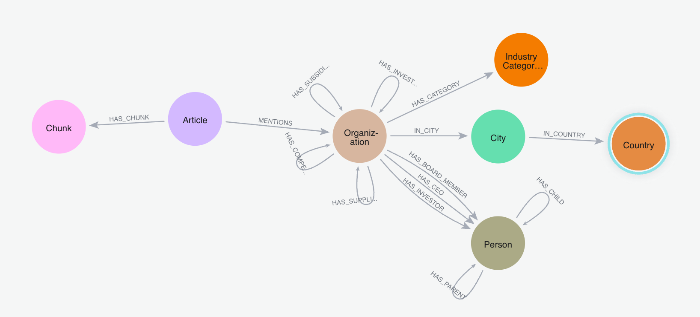

= GraphRAG Fundamentals training course

A hands-on online training course for learning GraphRAG. Hosted for Pearson through O'Reilly media.

////
TODOs:
- ?
////

== Overview

This repository contains a completed solution for implementing GraphRAG with a variety of different approaches:

- manual GraphRAG: assembling vector search + graph retrieval
- Spring advisors: out-of-the-box, yet customizable, approaches to RAG
- agents: allowing LLM to decide best function(s) for each question

Technologies used include:

- Spring AI Java framework (Langchain4j also an alternative)
- Neo4j graph database
- OpenAI model (text-embedding-ada-002)

== Requirements

In order to run the application, you will need the following things:

1. OpenAI key (temporary key is granted by presenter during live course)
2. Java 17 or higher
3. Maven

== Data and data model

A Neo4j database is set up with data pre-loaded for you to use. You are welcome to connect to this public, read-only instance or configure your own. The data schema for this instance is shown below. Though not every entity is defined in our application, the domain classes are enough to explore for this course.



Feel free to add entities or change things for further development later on!

== Environment setup

1. Rename the `src/main/resources/exampleEnv.sh` script to `env.sh`:
```
cp src/main/resources/exampleEnv.sh src/main/resources/env.sh
```
2. OpenAI API Key: Set your OpenAI API key in the copied `env.sh` script:
```
export OPENAI_API_KEY=your_openai_api_key_here
```
3. Run the `env.sh` to set your environment:
```
source ./env.sh
```

== Running the application

Set environment variable (if applicable) for Large Language Model - e.g. Open AI.

[source,shell]
----
source ./env.sh
----

Run the application.

[source,shell]
----
./mvnw spring-boot:run
----

Test the endpoints.

[source,shell]
----
#Graph query
http ":8080/articleMentions"

#LLM questions
http ":8080/llm?question=Who is Jennifer Reif?"
http ":8080/llm?question=Could you create a short poem about technology in the style of Emily Dickinson?"
http ":8080//llm?question=Who is Jennifer Reif using this as context? Jennifer Reif is a developer advocate at Neo4j, focusing on the Java ecosystem. She is a technical speaker, blogger, podcaster, and author, with an MS in CMIS."
http ":8080/llm?question=What is the latest news about toys?"

#Vector RAG questions
http ":8080/manualRAG?question=What is the latest news about toys?"
##bare minimum results
http ":8080/manualRAG?question=What organizations are mentioned related to layoffs?"

#GraphRAG questions
http ":8080/manualGraphRAG?question=What organizations are mentioned related to layoffs?"
http ":8080/manualGraphRAG?question=Which industries are most affected by the layoffs?"
#GraphRAG (advisor) questions
http ":8080/graphRAG?question=Are there new launch announcements in the news?"
http ":8080/graphRAG?question=Which industries are seeing the most change?"
http ":8080/graphRAG?question=What are the major funding announcements related to technology?"

##DEMO portion:

#Bad RAG question
http ":8080/manualGraphRAG?question=What is the latest news with Volkswagen?"
http ":8080/compare?question=What is the latest news with Volkswagen?"
#Good RAG questions
http ":8080/manualRAG?question=Were there major investments made recently?"
http ":8080/manualGraphRAG?question=Are there organizations with major investments recently?"

#Agentic
http ":8080/agents/debug/tools"
#Vector agent
http ":8080/agents/agentic?question=What news is related to cybersecurity threats?"
http ":8080/agents/agentic?question=Are there any major funding announcements related to technology?"
#Graph agent
http ":8080/agents/agentic?question=Which industries are seeing the most change?"
http ":8080/agents/agentic?question=Which organizations are dealing with layoffs?"
#Text2Cypher agent
http ":8080/agents/agentic?question=Which organizations are not public and have revenue over 50 billion?"
http ":8080/agents/agentic?question=Where is iDefense organization located?"
http ":8080/agents/agentic?question=How many employees does CRMWaypoint have?"
http ":8080/agents/agentic?question=Which organizations are mentioned most in articles?"
----

== Labs

Instructions for hands-on exercises are available in the `labs.adoc` file.

== Presentation slides

* https://speakerdeck.com/jmhreif/pearsonolt-graphragfundamentals-oct2025[GraphRAG Fundamentals^]

== Resources

* Course page: https://www.oreilly.com/live-events/graphrag-fundamentals/0642572221072/[GraphRAG Fundamentals^]
* Neo4j courses: https://graphacademy.neo4j.com/knowledge-graph-rag/[Graphacademy knowledge graph^]
* Instructor: https://jmhreif.com/[Find Jennifer Reif^]
* More examples:
** https://github.com/JMHReif/spring-ai-rag-advisors[Spring AI advisors with Neo4j^]
** https://github.com/JMHReif/rag-vector-graph[Spring AI agents, Neo4j, and MCP^]
** https://github.com/JMHReif/spring-ai-mcp-demo[Spring AI, Neo4j, MCP^]
** https://github.com/JMHReif/basic-ai-chat-app[Ollama basic chat (no RAG or tools)^]
** https://github.com/JMHReif/springai-goodreads[Spring AI and Neo4j with Goodreads data^]
** https://github.com/JMHReif/langchain4j-quarkus-goodreads[Quarkus, Langchain4j, and Neo4j with Goodreads data^]